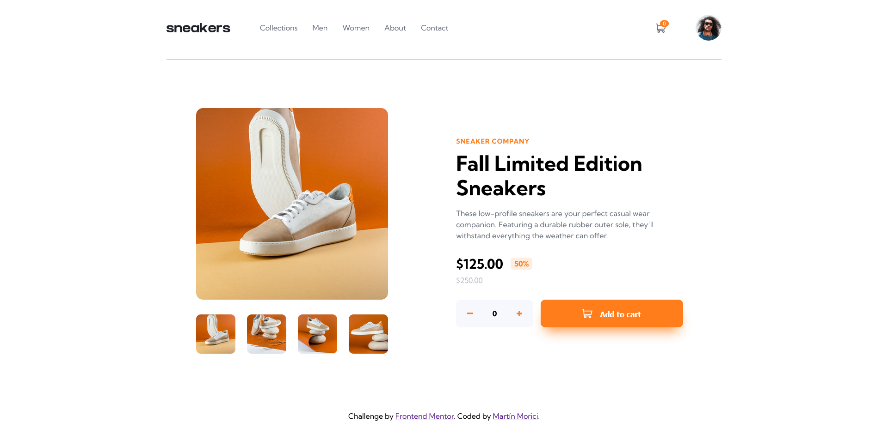
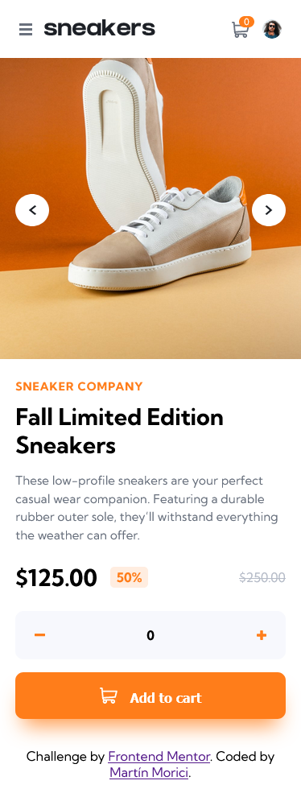

# Frontend Mentor - E-commerce product page solution

This is a solution to the [E-commerce product page challenge on Frontend Mentor](https://www.frontendmentor.io/challenges/ecommerce-product-page-UPsZ9MJp6).

## Overview

### The challenge

Users should be able to:

-  View the optimal layout for the site depending on their device's screen size
-  See hover states for all interactive elements on the page
-  Switch the large product image by clicking on the small thumbnail images
-  Add items to the cart
-  View the cart and remove items from it

### Screenshot

### Links

-  Live Site URL: [Ecommerce Product Page](https://ecommerce-product-page-coral.vercel.app/)

### Built with

-  Semantic HTML5 markup
-  CSS custom properties
-  Flexbox
-  CSS Grid
-  Mobile-first workflow
-  SASS
-  JavaScript Vanilla
